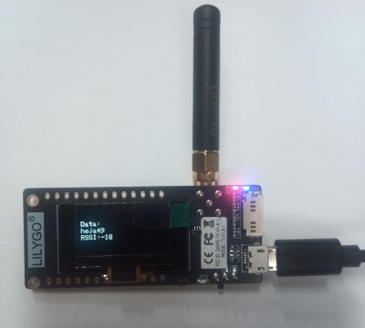

# LoRa Communication with LilyGo T-Display and SSD1306 OLED

This project demonstrates the use of a **LilyGo T-Display** board equipped with an **SX1278 LoRa module** and an **SSD1306 OLED screen** to send and receive data using **LoRa** communication.

## Features
- **Sending LoRa packets**: The board sends a message "heja" followed by a counter value every second.
- **Receiving LoRa packets**: The board listens for incoming LoRa messages and displays them on the OLED screen.
- **RSSI Display**: The Received Signal Strength Indicator (RSSI) for each received packet is displayed, helping to monitor signal quality.
- **OLED Display**: Uses the SSD1306 OLED to display messages and RSSI values.

## Hardware Requirements
- **LilyGo T-Display** board with ESP32.
- **SX1278 LoRa module**.
- **SSD1306 OLED display**.
  
### Pin Connections
- **LoRa Module**:
  - SCK: Pin 5
  - MISO: Pin 19
  - MOSI: Pin 27
  - SS: Pin 18
  - RST: Pin 14
  - DIO0: Pin 26
- **SSD1306 OLED**: I2C communication (default address: `0x3C`).

## Code Overview
1. **LoRa Initialization**: Initializes the LoRa module at 433 MHz and configures maximum transmission power.
2. **OLED Display**: Uses the Adafruit SSD1306 library to initialize and manage the OLED screen.
3. **Packet Transmission**: Sends a packet containing a message and a counter every 1 second.
4. **Packet Reception**: Receives incoming LoRa messages and displays them on the serial monitor and OLED display, along with the RSSI value.

## Libraries Used
- `LoRa`: Handles LoRa communication.
- `Adafruit_GFX` and `Adafruit_SSD1306`: For OLED display control.

## How to Run
1. Connect the hardware as per the pin connections mentioned.
2. Upload the provided code using the **Arduino IDE**.
3. View sent and received messages via the **Serial Monitor** and the OLED screen.

## License
This project is open-source and available under the [GPL-3.0 license](LICENSE).
